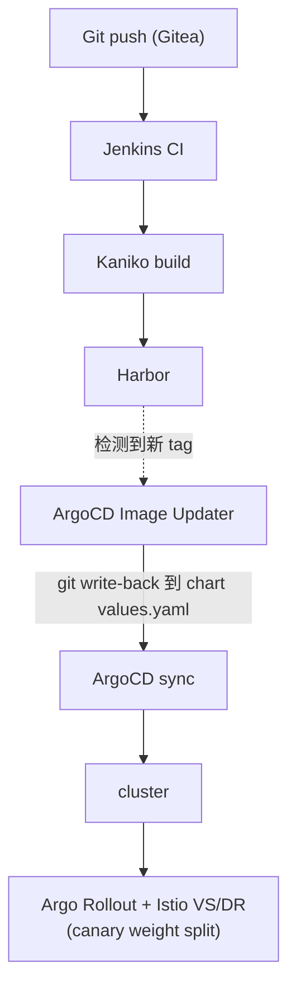

# gitops-lab

自建3节点Kubernetes homelab的GitOps控制仓库,使用ArgoCD的**App-of-Apps**模式进行端到端管理。本仓库是平台组件、应用交付以及secrets的唯一事实来源(single source of truth)。**日常day-2运维中不使用`kubectl apply`。**

> **事实来源:** 自建Gitea(`linux03.local:3000`)。GitHub上的副本仅作为**push mirror**,用于作品集/备份——ArgoCD从Gitea拉取,而非GitHub。

---

## 架构概览

| 层级 | 选型 |
|---|---|
| Cluster | kubeadm v1.36.0,containerd,Flannel CNI(vxlan,pod CIDR `10.244.0.0/16`) |
| Nodes | 3 × arm64 Rocky Linux 10.1(1 control-plane + 2 workers,运行于Parallels/M4) |
| GitOps | ArgoCD(App-of-Apps + ApplicationSet),Image Updater(CR驱动,`method: git`) |
| CI | Jenkins(JCasC controller + 动态Kaniko/Python agents),Gitea webhooks |
| Registry | Harbor(self-signed,`linux02.local:443`) |
| Service mesh | Istio(sidecar模式),Argo Rollouts(渐进式交付) |
| Ingress | 双入口:Istio ingress gateway负责应用流量,NGF负责平台工具 |
| Observability | kube-prometheus-stack;EFK(Fluent Bit → Elasticsearch → Kibana,ECK) |
| Messaging | Strimzi运维的Kafka(KRaft模式,3节点combined pool) |
| Storage | Longhorn(默认2-replica + 供应用级复制型workload使用的single-replica class) |
| Secrets | Sealed Secrets——每个手动创建的secret都以加密形式存于本仓库 |

### GitOps交付流程



### Ingress模型(双入口)

- **Istio ingress gateway**——VIP `10.211.55.201`,用于需要精确流量控制(canary)的应用。TLS通过`istio-ingress` namespace中的`local-tls`提供(`credentialName`要求secret位于同一namespace)。
- **NGF main-gateway**——VIP `10.211.55.200`,用于平台工具(Grafana、Kibana、Jenkins、ArgoCD、Prometheus)。TLS在gateway处终止。

---

## 仓库结构

```
.
├── root-app.yaml              # ArgoCD root Application(App-of-Apps 入口)
├── bootstrap/                 # ArgoCD 之前的层,集群诞生时应用一次
│   ├── kubeadm-config.yaml
│   ├── flannel/               #   原始上游 manifest + kustomize overlay
│   ├── metrics-server/        #   同样的模式(upstream/ + kustomization.yaml)
│   └── argocd/                #   vendored Helm chart(.tgz)+ values.yaml
├── infra/                     # 平台层 —— 每个目录一个 ArgoCD Application
│   ├── metallb/               #   <name>-app.yaml + <name>-values.yaml(Helm apps)
│   ├── nginx-gateway-fabric/
│   ├── istio/                 #   istio-base / istiod / ingressgateway apps
│   │   └── manifests/         #     shared-gateway.yaml
│   ├── networking/manifests/  #   Gateway API routes/,MetalLB IP pool
│   ├── monitoring/            #   kube-prometheus-stack
│   ├── logging/               #   eck-operator / elastic-stack / fluent-bit /
│   │   └── manifests/         #     es-exporter apps;elasticsearch.yaml、kibana.yaml
│   ├── kafka/                 #   strimzi-operator app + kafka app
│   │   └── manifests/         #     Kafka CR、metrics/dashboards CMs、PodMonitor
│   ├── longhorn/manifests/    #   额外的 StorageClass、VolumeSnapshotClass
│   ├── jenkins/               #   Helm app + JCasC values
│   ├── argo-rollouts/  argocd-image-updater/  redis/  snapshot-controller/
│   ├── sealed-secrets/        #   Sealed Secrets controller(Helm app)
│   └── secrets/               #   SealedSecret manifests,按 namespace 分组
│       └── manifests/<ns>/<name>.yaml
└── apps/                      # 业务应用,经由 ApplicationSet
    ├── apps-appset.yaml       #   Git file generator:apps/*/config.yaml
    └── <app>/config.yaml      #   generator 消费的每应用参数
```

### 各部分如何串联

- **`root-app.yaml`**是唯一手动apply的Application。它发现`infra/`下的Application manifests(`*-app.yaml`)以及`apps/apps-appset.yaml`;原始载荷(`manifests/`、values文件)由各自的子Application拥有,绝不由root二次管理。
- **`infra/<component>/<component>-app.yaml`**——每个平台组件一个Application。基于Helm的组件使用ArgoCD multi-source:chart来自上游Helm repo + values经由`$values` ref来自本仓库。
- **`apps/apps-appset.yaml`**——带Git file generator的ApplicationSet;每个`apps/<app>/config.yaml`生成一个Application。新增应用 = 新增一个文件。

---

## GitOps下的Secrets

所有手动创建的secrets(registry creds、TLS certs、ArgoCD repo credentials、应用密码)都以加密的**SealedSecret** manifest形式存于`infra/secrets/manifests/`,由集群内的controller解密。sealing key是唯一保存在Git之外的secret(离线备份)——恢复它是灾难恢复中唯一的手动步骤。

Operator生成的secrets(ECK、Strimzi、Istio CAs、webhook certs)有意排除:它们是由各自controller拥有的派生状态,对其sealing会造成ownership冲突。参见`infra/secrets/README.md`。

---

## 运维

### 首次bootstrap

```bash
# 1. kubeadm init/join,然后应用 bootstrap/(Flannel、metrics-server、ArgoCD)
# 2. 恢复 Sealed Secrets master key(唯一的手动 secret)
# 3. 把 root 交给 ArgoCD —— 它会从 Git 协调其余一切
kubectl apply -f root-app.yaml
argocd app sync root --grpc-web
```

### 新增一个应用

```bash
mkdir -p apps/<app>
# 添加 config.yaml —— ApplicationSet generator 会自动识别
git add apps/<app> && git commit -m "add <app>" && git push
```

### 变更一个平台组件

绝不对ArgoCD管理的资源执行`kubectl apply`——编辑Git,然后sync。

```bash
# 编辑 infra/<component>/*-values.yaml 或 infra/<component>/manifests/...
git commit -am "update <component>" && git push
argocd app sync <component> --grpc-web
```

### 新增一个secret

```bash
kubectl -n <ns> create secret generic <name> --from-literal=k=v \
  --dry-run=client -o yaml | kubeseal --format yaml \
  > infra/secrets/manifests/<ns>/<name>.yaml
git add infra/secrets && git commit -m "add secret <ns>/<name>" && git push
```

### 验证集群状态

```bash
kubectl -n argocd get applications
kubectl -n argocd get applications | grep -v Synced   # 理想情况下只剩表头
kubectl get sealedsecrets -A                          # 全部 Synced=True
```

---

## 约定与护栏

- **GitOps纪律:** 所有变更都经由Git commit。对管理中的资源直接`kubectl apply`会被sync还原。
- **root和拥有CRD的Application上`prune: false`**——防止级联删除子Application / CRD实例。Strimzi CRDs额外要求`ServerSideApply=true`(256KB annotation上限)。
- **Istio流量切分:** DestinationRule `host`指向root service(而非stable);外部流量必须经由Istio ingress gateway进入才能遵循VirtualService weights(NGF不是mesh member);在VS的`gateways`中保留`mesh`,让东西向调用也遵循weights。
- **Controller只协调它watch的对象:** 删除下游Secret不会触发Sealed Secrets controller(它watch `SealedSecret`);编辑ECK拥有的StatefulSet会被立即还原(它watch CR之下的一切)。始终操作controller视为期望状态的那个资源。
- **每次chart变更都以diff形式交付:** 每次commit前先做`helm template`前后对比加server-side dry-run。
- **ArgoCD CLI**始终使用`--grpc-web`。


Author: YIFAN JIA (jif)
