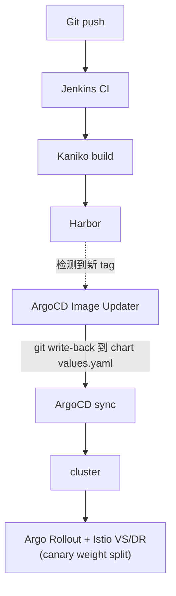

# gitops-lab

自建 3 节点 Kubernetes homelab 的 GitOps 控制仓库,使用 ArgoCD 的 **App-of-Apps** 模式进行端到端管理。本仓库是平台组件、应用交付以及 secrets 的唯一事实来源(single source of truth)。**日常 day-2 运维中不使用 `kubectl apply`。**

> **事实来源:** 自建 Gitea(`linux03.local:3000`)。GitHub 上的副本仅作为 **push mirror**,用于作品集/备份——ArgoCD 从 Gitea 拉取,而非 GitHub。

---

## 架构概览

| 层级 | 选型 |
|---|---|
| Cluster | kubeadm v1.36.0,containerd,Flannel CNI(vxlan,pod CIDR `10.244.0.0/16`) |
| Nodes | 3 × arm64 Rocky Linux 10.1(1 control-plane + 2 workers,运行于 Parallels/M4) |
| GitOps | ArgoCD(App-of-Apps + ApplicationSet),Image Updater(CR 驱动,`method: git`) |
| CI | Jenkins(JCasC controller + 动态 Kaniko/Python agents),Gitea webhooks |
| Registry | Harbor(self-signed,`linux02.local:443`) |
| Service mesh | Istio(sidecar 模式),Argo Rollouts(渐进式交付) |
| Ingress | 双入口:Istio ingress gateway 负责应用流量,NGF 负责平台工具 |
| Observability | kube-prometheus-stack;EFK(Fluent Bit → Elasticsearch → Kibana,ECK) |
| Messaging | Strimzi 运维的 Kafka(KRaft 模式,3 节点 combined pool) |
| Storage | Longhorn(默认 2-replica + 供应用级复制型 workload 使用的 single-replica class) |
| Secrets | Sealed Secrets——每个手动创建的 secret 都以加密形式存于本仓库 |

### GitOps 交付流程



### Ingress 模型(双入口)

- **Istio ingress gateway**——VIP `10.211.55.201`,用于需要精确流量控制(canary)的应用。TLS 通过 `istio-ingress` namespace 中的 `local-tls` 提供(`credentialName` 要求 secret 位于同一 namespace)。
- **NGF main-gateway**——VIP `10.211.55.200`,用于平台工具(Grafana, Kibana, Jenkins, ArgoCD, Prometheus)。TLS 在 gateway 处终止。

---

## 仓库结构

```
.
├── root-app.yaml              # ArgoCD root Application(App-of-Apps 入口)
├── bootstrap/                 # ArgoCD 之前的层,集群诞生时应用一次
│   ├── kubeadm-config.yaml
│   ├── flannel/               #   原始上游 manifest + kustomize overlay
│   ├── metrics-server/        #   同样的模式(upstream/ + kustomization.yaml)
│   └── argocd/                #   vendored Helm chart(.tgz)+ values.yaml
├── infra/                     #   平台层 —— 每个目录一个 ArgoCD Application
│   ├── metallb/               #   <name>-app.yaml + <name>-values.yaml(Helm apps)
│   ├── nginx-gateway-fabric/
│   ├── istio/                 #   istio-base / istiod / ingressgateway apps
│   │   └── manifests/         #     shared-gateway.yaml
│   ├── networking/manifests/  #   Gateway API routes/,MetalLB IP pool
│   ├── monitoring/            #   kube-prometheus-stack
│   ├── logging/               #   eck-operator / elastic-stack / fluent-bit /
│   │   └── manifests/         #     es-exporter apps;elasticsearch.yaml、kibana.yaml
│   ├── kafka/                 #   strimzi-operator app + kafka app
│   │   └── manifests/         #     Kafka CR、metrics/dashboards CMs、PodMonitor
│   ├── longhorn/manifests/    #   额外的 StorageClass、VolumeSnapshotClass
│   ├── jenkins/               #   Helm app + JCasC values
│   ├── argo-rollouts/  argocd-image-updater/  redis/  snapshot-controller/
│   ├── sealed-secrets/        #   Sealed Secrets controller(Helm app)
│   └── secrets/               #   SealedSecret manifests,按 namespace 分组
│       └── manifests/<ns>/<name>.yaml
└── apps/                      #   业务应用,经由 ApplicationSet
    ├── apps-appset.yaml       #   Git file generator:apps/*/config.yaml
    └── <app>/config.yaml      #   generator 消费的每应用参数
```

### 各部分如何串联

- **`root-app.yaml`** 是唯一手动 apply 的 Application。它发现 `infra/` 下的 Application manifests(`*-app.yaml`)以及 `apps/apps-appset.yaml`;原始载荷(`manifests/`、values 文件)由各自的子 Application 拥有,绝不由 root 二次管理。
- **`infra/<component>/<component>-app.yaml`**——每个平台组件一个 Application。基于 Helm 的组件使用 ArgoCD multi-source:chart 来自上游 Helm repo + values 经由 `$values` ref 来自本仓库。
- **`apps/apps-appset.yaml`**——带 Git file generator 的 ApplicationSet;每个 `apps/<app>/config.yaml` 生成一个 Application。新增应用 = 新增一个文件。

---

## GitOps 下的 Secrets

所有手动创建的 secrets(registry creds, TLS certs, ArgoCD repo credentials, 应用密码)都以加密的 **SealedSecret** manifest 形式存于 `infra/secrets/manifests/`,由集群内的 controller 解密。sealing key 是唯一保存在 Git 之外的 secret(离线备份)——恢复它是灾难恢复中唯一的手动步骤。

Operator 生成的 secrets(ECK, Strimzi, Istio CAs, webhook certs)有意排除:它们是由各自 controller 拥有的派生状态,对其 sealing 会造成 ownership 冲突。参见 `infra/secrets/README.md`。

---

## 运维

### 首次 bootstrap

```bash
# 1. kubeadm init/join,然后应用 bootstrap/(Flannel、metrics-server、ArgoCD)
# 2. 恢复 Sealed Secrets master key(唯一的手动 secret)
# 3. 把 root 交给 ArgoCD —— 它会从 Git 协调其余一切
kubectl apply -f root-app.yaml
argocd app sync root --grpc-web
```

### 新增一个应用

```bash
mkdir -p apps/<app>
# 添加 config.yaml —— ApplicationSet generator 会自动识别
git add apps/<app> && git commit -m "add <app>" && git push
```

### 变更一个平台组件

绝不对 ArgoCD 管理的资源执行 `kubectl apply`——编辑 Git,然后 sync。

```bash
# 编辑 infra/<component>/*-values.yaml 或 infra/<component>/manifests/...
git commit -am "update <component>" && git push
argocd app sync <component> --grpc-web
```

### 新增一个 secret

```bash
kubectl -n <ns> create secret generic <name> --from-literal=k=v \
  --dry-run=client -o yaml | kubeseal --format yaml \
  > infra/secrets/manifests/<ns>/<name>.yaml
git add infra/secrets && git commit -m "add secret <ns>/<name>" && git push
```

### 验证集群状态

```bash
kubectl -n argocd get applications
kubectl -n argocd get applications | grep -v Synced   # 理想情况下只剩表头
kubectl get sealedsecrets -A                          # 全部 Synced=True
```

---

## 约定与护栏

- **GitOps 纪律:** 所有变更都经由 Git commit。对管理中的资源直接 `kubectl apply` 会被 sync 还原。
- **root 和拥有 CRD 的 Application 上 `prune: false`**——防止级联删除子 Application / CRD 实例。Strimzi CRDs 额外要求 `ServerSideApply=true`(256KB annotation 上限)。
- **Istio 流量切分:** DestinationRule `host` 指向 root service(而非 stable);外部流量必须经由 Istio ingress gateway 进入才能遵循 VirtualService weights(NGF 不是 mesh member);在 VS 的 `gateways` 中保留 `mesh`,让东西向调用也遵循 weights。
- **Controller 只协调它 watch 的对象:** 删除下游 Secret 不会触发 Sealed Secrets controller(它 watch `SealedSecret`);编辑 ECK 拥有的 StatefulSet 会被立即还原(它 watch CR 之下的一切)。始终操作 controller 视为期望状态的那个资源。
- **每次 chart 变更都以 diff 形式交付:** 每次 commit 前先做 `helm template` 前后对比加 server-side dry-run。
- **ArgoCD CLI** 始终使用 `--grpc-web`。


Author: YIFAN JIA (Jif)
